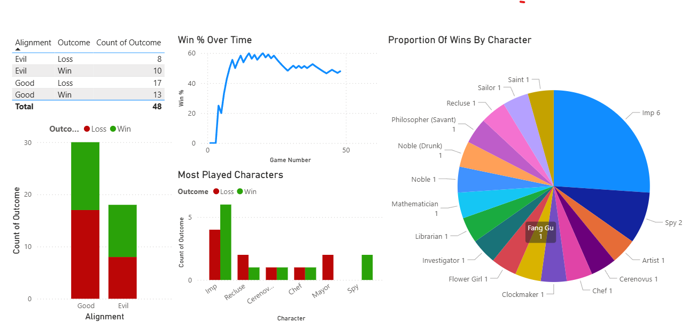
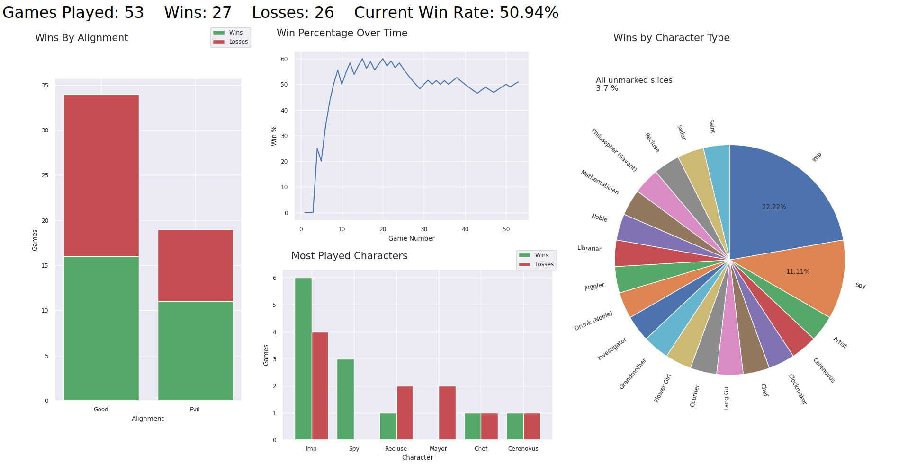

# Blood On The Clocktower (BotC) Data Visualisation

Blood On The Clocktower is a social deduction game that I've played quite a few games of. I've been keeping track of the games I've played, and I thought that a good exercise in data visualisation would be to create a report of this data in Microsoft Power BI.

The data used (accurate as of 11/08/2025) can be viewed in the table below:

<details>
<summary><strong>BotC Games</strong></summary>

<table class="tg"><thead>
  <tr>
    <th class="tg-0pky">Game Number</th>
    <th class="tg-0pky">Date</th>
    <th class="tg-0pky">Type</th>
    <th class="tg-0pky">Script</th>
    <th class="tg-0pky">Alignment</th>
    <th class="tg-0pky">Character</th>
    <th class="tg-0pky">Outcome</th>
    <th class="tg-0pky">Win %</th>
  </tr></thead>
<tbody>
  <tr>
    <td class="tg-dvpl">1</td>
    <td class="tg-dvpl">26/06/2024</td>
    <td class="tg-0pky">Normal</td>
    <td class="tg-0pky">Trouble Brewing</td>
    <td class="tg-0pky">Good</td>
    <td class="tg-0pky">Chef</td>
    <td class="tg-0pky">Loss</td>
    <td class="tg-0pky">0</td>
  </tr>
  <tr>
    <td class="tg-dvpl">2</td>
    <td class="tg-dvpl">26/06/2024</td>
    <td class="tg-0pky">Normal</td>
    <td class="tg-0pky">Trouble Brewing</td>
    <td class="tg-0pky">Good</td>
    <td class="tg-0pky">Mayor</td>
    <td class="tg-0pky">Loss</td>
    <td class="tg-0pky">0</td>
  </tr>
  <tr>
    <td class="tg-dvpl">3</td>
    <td class="tg-dvpl">01/07/2024</td>
    <td class="tg-0pky">Normal</td>
    <td class="tg-0pky">My Beloved Monster</td>
    <td class="tg-0pky">Good</td>
    <td class="tg-0pky">Balloonist</td>
    <td class="tg-0pky">Loss</td>
    <td class="tg-0pky">0</td>
  </tr>
  <tr>
    <td class="tg-dvpl">4</td>
    <td class="tg-dvpl">01/07/2024</td>
    <td class="tg-0pky">Normal</td>
    <td class="tg-0pky">Land Of The Midnight Sun</td>
    <td class="tg-0pky">Good</td>
    <td class="tg-0pky">Clockmaker</td>
    <td class="tg-0pky">Win</td>
    <td class="tg-0pky">25</td>
  </tr>
  <tr>
    <td class="tg-dvpl">5</td>
    <td class="tg-dvpl">01/07/2024</td>
    <td class="tg-0pky">Teensyville</td>
    <td class="tg-0pky">Race To The Bottom</td>
    <td class="tg-0pky">Evil</td>
    <td class="tg-0pky">Vortox</td>
    <td class="tg-0pky">Loss</td>
    <td class="tg-0pky">20</td>
  </tr>
  <tr>
    <td class="tg-dvpl">6</td>
    <td class="tg-dvpl">17/07/2024</td>
    <td class="tg-0pky">Normal</td>
    <td class="tg-0pky">Trouble Brewing</td>
    <td class="tg-0pky">Evil</td>
    <td class="tg-0pky">Imp</td>
    <td class="tg-0pky">Win</td>
    <td class="tg-0pky">33.33333333</td>
  </tr>
  <tr>
    <td class="tg-dvpl">7</td>
    <td class="tg-dvpl">17/07/2024</td>
    <td class="tg-0pky">Normal</td>
    <td class="tg-0pky">Trouble Brewing</td>
    <td class="tg-0pky">Evil</td>
    <td class="tg-0pky">Imp</td>
    <td class="tg-0pky">Win</td>
    <td class="tg-0pky">42.85714286</td>
  </tr>
  <tr>
    <td class="tg-dvpl">8</td>
    <td class="tg-dvpl">24/07/2024</td>
    <td class="tg-0pky">Normal</td>
    <td class="tg-0pky">Trouble Brewing</td>
    <td class="tg-0pky">Good</td>
    <td class="tg-0pky">Saint</td>
    <td class="tg-0pky">Win</td>
    <td class="tg-0pky">50</td>
  </tr>
  <tr>
    <td class="tg-dvpl">9</td>
    <td class="tg-dvpl">24/07/2024</td>
    <td class="tg-0pky">Normal</td>
    <td class="tg-0pky">Trouble Brewing</td>
    <td class="tg-0pky">Evil</td>
    <td class="tg-0pky">Spy</td>
    <td class="tg-0pky">Win</td>
    <td class="tg-0pky">55.55555556</td>
  </tr>
  <tr>
    <td class="tg-dvpl">10</td>
    <td class="tg-dvpl">31/07/2024</td>
    <td class="tg-0pky">Normal</td>
    <td class="tg-0pky">Bad Moon Rising</td>
    <td class="tg-0pky">Evil</td>
    <td class="tg-0pky">Godfather</td>
    <td class="tg-0pky">Loss</td>
    <td class="tg-0pky">50</td>
  </tr>
  <tr>
    <td class="tg-dvpl">11</td>
    <td class="tg-dvpl">31/07/2024</td>
    <td class="tg-0pky">Normal</td>
    <td class="tg-0pky">Sects &amp; Violets</td>
    <td class="tg-0pky">Good</td>
    <td class="tg-0pky">Mathematician</td>
    <td class="tg-0pky">Win</td>
    <td class="tg-0pky">54.54545455</td>
  </tr>
  <tr>
    <td class="tg-dvpl">12</td>
    <td class="tg-dvpl">17/08/2024</td>
    <td class="tg-0pky">Normal</td>
    <td class="tg-0pky">Trouble Brewing</td>
    <td class="tg-0pky">Evil</td>
    <td class="tg-0pky">Imp</td>
    <td class="tg-0pky">Win</td>
    <td class="tg-0pky">58.33333333</td>
  </tr>
  <tr>
    <td class="tg-dvpl">13</td>
    <td class="tg-dvpl">24/08/2024</td>
    <td class="tg-0pky">Normal</td>
    <td class="tg-0pky">A Perfect Place</td>
    <td class="tg-0pky">Evil</td>
    <td class="tg-0pky">Cerenovus</td>
    <td class="tg-0pky">Loss</td>
    <td class="tg-0pky">53.84615385</td>
  </tr>
  <tr>
    <td class="tg-dvpl">14</td>
    <td class="tg-dvpl">30/08/2024</td>
    <td class="tg-0pky">Normal</td>
    <td class="tg-0pky">Back To School</td>
    <td class="tg-0pky">Good</td>
    <td class="tg-0pky">Librarian</td>
    <td class="tg-0pky">Win</td>
    <td class="tg-0pky">57.14285714</td>
  </tr>
  <tr>
    <td class="tg-dvpl">15</td>
    <td class="tg-dvpl">30/08/2024</td>
    <td class="tg-0pky">Normal</td>
    <td class="tg-0pky">(You Will Never) Break The Chain</td>
    <td class="tg-0pky">Good</td>
    <td class="tg-0pky">Sailor</td>
    <td class="tg-0pky">Win</td>
    <td class="tg-0pky">60</td>
  </tr>
  <tr>
    <td class="tg-dvpl">16</td>
    <td class="tg-dvpl">31/08/2024</td>
    <td class="tg-0pky">Normal</td>
    <td class="tg-0pky">Trouble Brewing</td>
    <td class="tg-0pky">Good</td>
    <td class="tg-0pky">Recluse</td>
    <td class="tg-0pky">Loss</td>
    <td class="tg-0pky">56.25</td>
  </tr>
  <tr>
    <td class="tg-dvpl">17</td>
    <td class="tg-dvpl">31/08/2024</td>
    <td class="tg-0pky">Normal</td>
    <td class="tg-0pky">Sects &amp; Violets</td>
    <td class="tg-0pky">Evil</td>
    <td class="tg-0pky">Cerenovus</td>
    <td class="tg-0pky">Win</td>
    <td class="tg-0pky">58.82352941</td>
  </tr>
  <tr>
    <td class="tg-dvpl">18</td>
    <td class="tg-dvpl">04/09/2024</td>
    <td class="tg-0pky">Normal</td>
    <td class="tg-0pky">Bad Moon Rising</td>
    <td class="tg-0pky">Good</td>
    <td class="tg-0pky">Pacifist</td>
    <td class="tg-0pky">Loss</td>
    <td class="tg-0pky">55.55555556</td>
  </tr>
  <tr>
    <td class="tg-dvpl">19</td>
    <td class="tg-dvpl">04/09/2024</td>
    <td class="tg-0pky">Normal</td>
    <td class="tg-0pky">Trouble Brewing</td>
    <td class="tg-0pky">Evil</td>
    <td class="tg-0pky">Imp</td>
    <td class="tg-0pky">Win</td>
    <td class="tg-0pky">57.89473684</td>
  </tr>
  <tr>
    <td class="tg-dvpl">20</td>
    <td class="tg-dvpl">07/09/2024</td>
    <td class="tg-0pky">Normal</td>
    <td class="tg-0pky">Sects &amp; Violets</td>
    <td class="tg-0pky">Good</td>
    <td class="tg-0pky">Philosopher (Savant)</td>
    <td class="tg-0pky">Win</td>
    <td class="tg-0pky">60</td>
  </tr>
  <tr>
    <td class="tg-dvpl">21</td>
    <td class="tg-dvpl">07/09/2024</td>
    <td class="tg-0pky">Normal</td>
    <td class="tg-0pky">Trouble Brewing</td>
    <td class="tg-0pky">Good</td>
    <td class="tg-0pky">Monk</td>
    <td class="tg-0pky">Loss</td>
    <td class="tg-0pky">57.14285714</td>
  </tr>
  <tr>
    <td class="tg-dvpl">22</td>
    <td class="tg-dvpl">07/09/2024</td>
    <td class="tg-0pky">Normal</td>
    <td class="tg-0pky">Trouble Brewing</td>
    <td class="tg-0pky">Good</td>
    <td class="tg-0pky">Chef</td>
    <td class="tg-0pky">Win</td>
    <td class="tg-0pky">59.09090909</td>
  </tr>
  <tr>
    <td class="tg-dvpl">23</td>
    <td class="tg-dvpl">07/09/2024</td>
    <td class="tg-0pky">Normal</td>
    <td class="tg-0pky">Trouble Brewing</td>
    <td class="tg-0pky">Good</td>
    <td class="tg-0pky">Recluse</td>
    <td class="tg-0pky">Loss</td>
    <td class="tg-0pky">56.52173913</td>
  </tr>
  <tr>
    <td class="tg-dvpl">24</td>
    <td class="tg-dvpl">07/09/2024</td>
    <td class="tg-0pky">Normal</td>
    <td class="tg-0pky">Smoked Onions</td>
    <td class="tg-0pky">Good</td>
    <td class="tg-0pky">Noble (Drunk)</td>
    <td class="tg-0pky">Win</td>
    <td class="tg-0pky">58.33333333</td>
  </tr>
  <tr>
    <td class="tg-dvpl">25</td>
    <td class="tg-dvpl">14/09/2024</td>
    <td class="tg-0pky">Normal</td>
    <td class="tg-0pky">Sects &amp; Violets</td>
    <td class="tg-0pky">Good</td>
    <td class="tg-0pky">Dreamer</td>
    <td class="tg-0pky">Loss</td>
    <td class="tg-0pky">56</td>
  </tr>
  <tr>
    <td class="tg-dvpl">26</td>
    <td class="tg-dvpl">14/09/2024</td>
    <td class="tg-0pky">Normal</td>
    <td class="tg-0pky">Trouble Brewing</td>
    <td class="tg-0pky">Good</td>
    <td class="tg-0pky">Mayor</td>
    <td class="tg-0pky">Loss</td>
    <td class="tg-0pky">53.84615385</td>
  </tr>
  <tr>
    <td class="tg-dvpl">27</td>
    <td class="tg-dvpl">21/09/2024</td>
    <td class="tg-0pky">Normal</td>
    <td class="tg-0pky">Sects &amp; Violets</td>
    <td class="tg-0pky">Good</td>
    <td class="tg-0pky">Town Crier</td>
    <td class="tg-0pky">Loss</td>
    <td class="tg-0pky">51.85185185</td>
  </tr>
  <tr>
    <td class="tg-dvpl">28</td>
    <td class="tg-dvpl">21/09/2024</td>
    <td class="tg-0pky">Normal</td>
    <td class="tg-0pky">Bad Moon Rising</td>
    <td class="tg-0pky">Good</td>
    <td class="tg-0pky">Exorcist</td>
    <td class="tg-0pky">Loss</td>
    <td class="tg-0pky">50</td>
  </tr>
  <tr>
    <td class="tg-dvpl">29</td>
    <td class="tg-dvpl">21/09/2024</td>
    <td class="tg-0pky">Normal</td>
    <td class="tg-0pky">Trouble Brewing</td>
    <td class="tg-0pky">Good</td>
    <td class="tg-0pky">Washerwoman</td>
    <td class="tg-0pky">Loss</td>
    <td class="tg-0pky">48.27586207</td>
  </tr>
  <tr>
    <td class="tg-dvpl">30</td>
    <td class="tg-dvpl">21/09/2024</td>
    <td class="tg-0pky">Normal</td>
    <td class="tg-0pky">Trouble Brewing</td>
    <td class="tg-0pky">Good</td>
    <td class="tg-0pky">Investigator</td>
    <td class="tg-0pky">Win</td>
    <td class="tg-0pky">50</td>
  </tr>
  <tr>
    <td class="tg-dvpl">31</td>
    <td class="tg-dvpl">27/09/2024</td>
    <td class="tg-0pky">Normal</td>
    <td class="tg-0pky">Dark and Stormy-caught</td>
    <td class="tg-0pky">Good</td>
    <td class="tg-0pky">Noble</td>
    <td class="tg-0pky">Win</td>
    <td class="tg-0pky">51.61290323</td>
  </tr>
  <tr>
    <td class="tg-dvpl">32</td>
    <td class="tg-dvpl">27/09/2024</td>
    <td class="tg-0pky">Normal</td>
    <td class="tg-0pky">Malchemy</td>
    <td class="tg-0pky">Evil</td>
    <td class="tg-0pky">Imp</td>
    <td class="tg-0pky">Loss</td>
    <td class="tg-0pky">50</td>
  </tr>
  <tr>
    <td class="tg-dvpl">33</td>
    <td class="tg-dvpl">27/09/2024</td>
    <td class="tg-0pky">Normal</td>
    <td class="tg-0pky">Malchemy</td>
    <td class="tg-0pky">Evil</td>
    <td class="tg-0pky">Fang Gu</td>
    <td class="tg-0pky">Win</td>
    <td class="tg-0pky">51.51515152</td>
  </tr>
  <tr>
    <td class="tg-dvpl">34</td>
    <td class="tg-dvpl">27/09/2024</td>
    <td class="tg-0pky">Normal</td>
    <td class="tg-0pky">Induced Labour</td>
    <td class="tg-0pky">Good</td>
    <td class="tg-0pky">Shugenja</td>
    <td class="tg-0pky">Loss</td>
    <td class="tg-0pky">50</td>
  </tr>
  <tr>
    <td class="tg-dvpl">35</td>
    <td class="tg-dvpl">28/09/2024</td>
    <td class="tg-0pky">Normal</td>
    <td class="tg-0pky">Trouble Brewing</td>
    <td class="tg-0pky">Evil</td>
    <td class="tg-0pky">Imp</td>
    <td class="tg-0pky">Win</td>
    <td class="tg-0pky">51.42857143</td>
  </tr>
  <tr>
    <td class="tg-dvpl">36</td>
    <td class="tg-dvpl">28/09/2024</td>
    <td class="tg-0pky">Normal</td>
    <td class="tg-0pky">Trouble Brewing</td>
    <td class="tg-0pky">Evil</td>
    <td class="tg-0pky">Imp</td>
    <td class="tg-0pky">Loss</td>
    <td class="tg-0pky">50</td>
  </tr>
  <tr>
    <td class="tg-dvpl">37</td>
    <td class="tg-dvpl">28/09/2024</td>
    <td class="tg-0pky">Normal</td>
    <td class="tg-0pky">Sects &amp; Violets</td>
    <td class="tg-0pky">Good</td>
    <td class="tg-0pky">Artist</td>
    <td class="tg-0pky">Win</td>
    <td class="tg-0pky">51.35135135</td>
  </tr>
  <tr>
    <td class="tg-dvpl">38</td>
    <td class="tg-dvpl">29/05/2025</td>
    <td class="tg-0pky">Normal</td>
    <td class="tg-0pky">Trouble Brewing</td>
    <td class="tg-0pky">Evil</td>
    <td class="tg-0pky">Imp</td>
    <td class="tg-0pky">Win</td>
    <td class="tg-0pky">52.63157895</td>
  </tr>
  <tr>
    <td class="tg-dvpl">39</td>
    <td class="tg-dvpl">29/05/2025</td>
    <td class="tg-0pky">Normal</td>
    <td class="tg-0pky">Trouble Brewing</td>
    <td class="tg-0pky">Evil</td>
    <td class="tg-0pky">Imp</td>
    <td class="tg-0pky">Loss</td>
    <td class="tg-0pky">51.28205128</td>
  </tr>
  <tr>
    <td class="tg-dvpl">40</td>
    <td class="tg-dvpl">29/05/2025</td>
    <td class="tg-0pky">Normal</td>
    <td class="tg-0pky">Trouble Brewing</td>
    <td class="tg-0pky">Evil</td>
    <td class="tg-0pky">Poisoner</td>
    <td class="tg-0pky">Loss</td>
    <td class="tg-0pky">50</td>
  </tr>
  <tr>
    <td class="tg-dvpl">41</td>
    <td class="tg-dvpl">18/06/2025</td>
    <td class="tg-0pky">Normal</td>
    <td class="tg-0pky">Trouble Brewing</td>
    <td class="tg-0pky">Good</td>
    <td class="tg-0pky">Ravenkeeper</td>
    <td class="tg-0pky">Loss</td>
    <td class="tg-0pky">48.7804878</td>
  </tr>
  <tr>
    <td class="tg-dvpl">42</td>
    <td class="tg-dvpl">18/06/2025</td>
    <td class="tg-0pky">Normal</td>
    <td class="tg-0pky">Trouble Brewing</td>
    <td class="tg-0pky">Good</td>
    <td class="tg-0pky">Soldier</td>
    <td class="tg-0pky">Loss</td>
    <td class="tg-0pky">47.61904762</td>
  </tr>
  <tr>
    <td class="tg-dvpl">43</td>
    <td class="tg-dvpl">26/06/2025</td>
    <td class="tg-0pky">Normal</td>
    <td class="tg-0pky">Trouble Brewing</td>
    <td class="tg-0pky">Evil</td>
    <td class="tg-0pky">Imp</td>
    <td class="tg-0pky">Loss</td>
    <td class="tg-0pky">46.51162791</td>
  </tr>
  <tr>
    <td class="tg-dvpl">44</td>
    <td class="tg-dvpl">26/06/2025</td>
    <td class="tg-0pky">Normal</td>
    <td class="tg-0pky">Trouble Brewing</td>
    <td class="tg-0pky">Evil</td>
    <td class="tg-0pky">Spy</td>
    <td class="tg-0pky">Win</td>
    <td class="tg-0pky">47.72727273</td>
  </tr>
  <tr>
    <td class="tg-dvpl">45</td>
    <td class="tg-dvpl">26/06/2025</td>
    <td class="tg-0pky">Normal</td>
    <td class="tg-0pky">Trouble Brewing</td>
    <td class="tg-0pky">Good</td>
    <td class="tg-0pky">Recluse</td>
    <td class="tg-0pky">Win</td>
    <td class="tg-0pky">48.88888889</td>
  </tr>
  <tr>
    <td class="tg-dvpl">46</td>
    <td class="tg-dvpl">06/08/2025</td>
    <td class="tg-0pky">Normal</td>
    <td class="tg-0pky">Sects &amp; Violets</td>
    <td class="tg-0pky">Good</td>
    <td class="tg-0pky">Sweetheart</td>
    <td class="tg-0pky">Loss</td>
    <td class="tg-0pky">47.82608696</td>
  </tr>
  <tr>
    <td class="tg-dvpl">47</td>
    <td class="tg-dvpl">06/08/2025</td>
    <td class="tg-0pky">Normal </td>
    <td class="tg-0pky">Sects &amp; Violets</td>
    <td class="tg-0pky">Good</td>
    <td class="tg-0pky">Barber</td>
    <td class="tg-0pky">Loss</td>
    <td class="tg-0pky">46.80851064</td>
  </tr>
  <tr>
    <td class="tg-dvpl">48</td>
    <td class="tg-dvpl">06/08/2025</td>
    <td class="tg-0pky">Normal</td>
    <td class="tg-0pky">Sects &amp; Violets</td>
    <td class="tg-0pky">Good</td>
    <td class="tg-0pky">Flower Girl</td>
    <td class="tg-0pky">Win</td>
    <td class="tg-0pky">47.91666667</td>
  </tr>
</tbody></table>

</details>


An image of the report can be seen below:



From this, we can see that my win percentage peaked at game 15, with a 60 % win rate, before decreasing after a string of losses to hover at around 45-50 %. Just over 25 % (6/23) of my wins have come as the imp, with a win rate of 56 % as evil and 43 % as good.

# Python GUI Dashboard

One problem I had with the Power BI dashboard was the inability for it to update automatically as I added games to the spreadsheet. To overcome this, I replicated the dashboard shown above as far as possible using the GUI Python module PyQT. I initially built the dashboard using tkinter, but upon further reading tkinter sounded slightly out of date, so replaced it with an alternative.

The below code downloads the google sheet to the computer, loads it into a dataframe, then deletes the downloaded file.

```python
import requests
import pandas as pd
from matplotlib.figure import Figure
import seaborn as sns
import os
import numpy as np
import sys
from matplotlib.backends.backend_qtagg import FigureCanvas
from matplotlib.backends.backend_qtagg import \
    NavigationToolbar2QT as NavigationToolbar
from matplotlib.backends.qt_compat import QtWidgets
from PyQt6.QtWidgets import QApplication, QLabel, QWidget
response = requests.get(spreadsheet_link)
assert response.status_code == 200, 'Wrong status code'
with open("BotC_stats.csv","wb") as file:
    file.write(response.content)

with open("BotC_stats.csv","r") as file:
    lines = file.readlines()
with open("BotC_stats.csv","w+") as file:
    for line in lines:
        if line[0] == ",":
            break
        else:
            file.write(line)

data = pd.read_csv("BotC_stats.csv")
os.remove("BotC_stats.csv")
data.columns = ["game_number","date","type","script","alignment","character","outcome","win_pc"]
```

Below defines all the plots used in the dashboard, each within their own function.

```python
titlesize=15
def running_wins(data):
    fig = Figure()
    ax = fig.add_subplot()
    ax.plot(data["game_number"],data["win_pc"])
    fig.suptitle("Win Percentage Over Time",horizontalalignment='right',size=titlesize)
    ax.set_xlabel("Game Number")
    ax.set_ylabel("Win %")
    return fig

def current_games(data):
    return len(data["outcome"]),len(data[data["outcome"].str.contains("Win")]),len(data[data["outcome"].str.contains("Loss")]),round((len(data[data["outcome"].str.contains("Win")])/len(data["outcome"]))*100,2)

def character_wins(data):
    def make_autopct(series):
        def my_autopct(value):
            if  round(value,1) == round(1/len(data[data["outcome"].str.contains("Win")])*100,1):
                return " "
            else:
                return f"{round(float(value),2)}%"
        return my_autopct
    sns.set_theme(font_scale = 0.8)
    win_data = data[data["outcome"].str.contains("Win")]
    characters = list(win_data.value_counts("character",normalize=True).keys())
    win_pc = win_data["character"].value_counts(normalize=True)
    fig = Figure()
    # figsize=(8,5)
    ax = fig.add_subplot()
    ax.pie(win_pc,labels=characters,startangle = 90,autopct=make_autopct(win_pc),counterclock=False,rotatelabels=True,radius=0.9)
    fig.suptitle("Wins by Character Type",horizontalalignment='right',size=titlesize)
    fig.text(0.1,0.85,f"All unmarked slices:\n{round(1/len(data[data["outcome"].str.contains("Win")])*100,1)} %",size=12)
    fig.tight_layout()
    return fig

def win_loss_alignment(data):
    alignments=["Good","Evil"]
    y1 = [data[data["alignment"].str.contains(alignment)]["outcome"].value_counts()["Win"] for alignment in ["Good","Evil"]]
    y2 = [data[data["alignment"].str.contains(alignment)]["outcome"].value_counts()["Loss"] for alignment in ["Good","Evil"]]
    fig = Figure(figsize=(3,4))
    ax = fig.add_subplot()
    ax.bar(alignments, y1, color='g',label="Wins")
    ax.bar(alignments, y2, bottom=y1, color='r',label="Losses")
    fig.suptitle("Wins By Alignment",horizontalalignment='right',size=titlesize)
    ax.set_ylabel("Games")
    ax.set_xlabel("Alignment")
    fig.legend()
    fig.tight_layout()
    return fig

def most_played_chars(data):
    characters = list(data["character"].value_counts().keys())
    games = data["character"].value_counts()
    for n,i in enumerate(games):
        if i == 1:
            characters=characters[:n]
            break
    
    wins=[]
    losses=[]
    xticklist = np.array([n for n,i in enumerate(characters)])
    xticklist = xticklist*1.25
    loss_ticks = xticklist+0.25
    win_ticks=xticklist-0.25
    
    for char in characters:
        char_data = data[data["character"].str.contains(char)]
        try:
            wins.append(char_data["outcome"].value_counts()["Win"])
        except:
            wins.append(0)
        try:
            losses.append(char_data["outcome"].value_counts()["Loss"])
        except:
            losses.append(0)
    fig = Figure()
    # figsize=(5,5)
    ax = fig.add_subplot()
    ax.bar(win_ticks, wins, color='g',label="Wins",width=0.5)
    ax.bar(loss_ticks, losses, color='r',label="Losses",width=0.5)
    fig.suptitle("Most Played Characters",horizontalalignment='right',size=titlesize)
    ax.set_xticks(xticklist)
    ax.set_xticklabels(characters)
    ax.set_xlabel("Character")
    ax.set_ylabel("Games")
    fig.legend()
    fig.tight_layout()
    return fig
```

Here we finally have the code to build the window.

```python
class ApplicationWindow(QtWidgets.QMainWindow):
    def __init__(self):
        super().__init__()
        self.setWindowTitle("BotC Statistics")
        self.setGeometry(0, 0, 1920, 1080)
        # app.setStyleSheet("QLabel{font-size: 18pt;}")
        self.setStyleSheet("QLabel{font-size: 25pt;}QMainWindow { background-color: rgb(255, 255, 255);}")
        
        self._main = QtWidgets.QWidget()
        self.setCentralWidget(self._main)
        
        layout = QtWidgets.QGridLayout(self._main)

        alignment_win_graph = FigureCanvas(win_loss_alignment(data))  
        layout.addWidget(alignment_win_graph,1,0,2,1)

        no_games,no_wins,no_losses,curr_win_rate = current_games(data)
        label = QLabel(f"Games Played: {no_games}    Wins: {no_wins}    Losses: {no_losses}    Current Win Rate: {curr_win_rate}%",self)

        layout.addWidget(label,0,0,1,2)


        win_rate_graph = FigureCanvas(running_wins(data))  
        layout.addWidget(win_rate_graph,1,1)

        character_win_graph = FigureCanvas(most_played_chars(data))  
        layout.addWidget(character_win_graph,2,1)

        character_win_graph = FigureCanvas(character_wins(data))  
        layout.addWidget(character_win_graph,1,2,2,2)


if __name__ == "__main__":
    qapp = QtWidgets.QApplication.instance()
    if not qapp:
        qapp = QtWidgets.QApplication(sys.argv)

    app = ApplicationWindow()
    
    app.show()
    app.activateWindow()
    app.raise_()
    qapp.exec()
```

The output of the code can be seen in the image below.



# Plotly HTML Dashboard

Plotly allows me to keep the interactivity that is present in Power BI, as well as the autoupdating of the dash created in Python. It can also be embedded in HTML, and can be seen below:

<div>                        <script type="text/javascript">window.PlotlyConfig = {MathJaxConfig: 'local'};</script>
        <script charset="utf-8" src="https://cdn.plot.ly/plotly-3.1.1.min.js" integrity="sha256-HUEFyfiTnZJxCxur99FjbKYTvKSzwDaD3/x5TqHpFu4=" crossorigin="anonymous"></script>                <div id="21246ada-0e9e-4a6f-904d-37458662da88" class="plotly-graph-div" style="height:800px; width:1200px;"></div>            <script type="text/javascript">                window.PLOTLYENV=window.PLOTLYENV || {};                                if (document.getElementById("21246ada-0e9e-4a6f-904d-37458662da88")) {                    Plotly.newPlot(                        "21246ada-0e9e-4a6f-904d-37458662da88",                        [{"name":"","showlegend":false,"x":{"dtype":"i1","bdata":"AQIDBAUGBwgJCgsMDQ4PEBESExQVFhcYGRobHB0eHyAhIiMkJSYnKCkqKywtLi8wMTIzNDU2Nzg5"},"y":{"dtype":"f8","bdata":"AAAAAAAAAAAAAAAAAAAAAAAAAAAAAAAAAAAAAAAAOUAAAAAAAAA0QCaCo6qqqkBAl9lz27ZtRUAAAAAAAABJQM6n0HEcx0tAAAAAAAAASUAq2mZ00UVLQCaCo6qqKk1AN5H0xE7sSkBpJowkSZJMQAAAAAAAAE5AAAAAAAAgTEBBn2VpaWlNQM6n0HEcx0tAxymdvIbyTEAAAAAAAABOQGkmjCRJkkxAxDq46KKLTUBeMgpZyEJMQCaCo6qqKk1AAAAAAAAATEA3kfTETuxKQMBkPnsJ7UlAAAAAAAAASUCubcRyTyNIQAAAAAAAAElAPDvwnHPOSUAAAAAAAABJQD5xKXzwwUlAAAAAAAAASUDL7Llt27ZJQAAAAAAAAElA5tO+FPmsSUDHizuU11BKQI2yn0EapElAAAAAAAAASUCo9jMG52NIQIhI0fM8z0dA3pX6BX1BR0CzT9dFF91HQPMpdBzHcUhAEG2uN73pR0BPotJGfWdHQNp9XFVV9UdAPh3yQ2N9SEAAAAAAAABJQMnFe4KCgkhAAAAAAAAASUCFgik1wXhJQAAAAAAAAElAPMVHF110SUBixi1JkuRJQL2wDNxHcElA"},"type":"scatter","xaxis":"x","yaxis":"y"},{"labels":["Imp","Spy","Chef","Clockmaker","Artist","Cerenovus","Drunk","Courtier","Flower Girl","Fang Gu","Investigator","Juggler","Librarian","Grandmother","Mathematician","Noble","Pit-Hag","Philosopher","Poisoner","Recluse","Sailor","Saint"],"name":"","values":{"dtype":"i1","bdata":"BgMBAQEBAQEBAQEBAQEBAQEBAQEBAQ=="},"type":"pie","domain":{"x":[0.55,1.0],"y":[0.0,0.375]}},{"hovertemplate":["Good: 16","Evil: 13"],"marker":{"color":"green"},"name":"Wins","offsetgroup":"1","x":["Good","Evil"],"y":[16,13],"type":"bar","xaxis":"x3","yaxis":"y3"},{"base":[16,13],"hovertemplate":["Good: 20","Evil: 8"],"marker":{"color":"firebrick"},"name":"Losses","offsetgroup":"1","x":["Good","Evil"],"y":[20,8],"type":"bar","xaxis":"x3","yaxis":"y3"},{"marker":{"color":"green"},"name":"Wins","x":["Imp","Recluse","Spy","Soldier","Cerenovus","Mayor","Chef","Poisoner"],"y":[6,1,3,0,1,0,1,1],"type":"bar","xaxis":"x2","yaxis":"y2"},{"marker":{"color":"firebrick"},"name":"Losses","x":["Imp","Recluse","Spy","Soldier","Cerenovus","Mayor","Chef","Poisoner"],"y":[4,2,0,2,1,2,1,1],"type":"bar","xaxis":"x2","yaxis":"y2"}],                        {"template":{"data":{"histogram2dcontour":[{"type":"histogram2dcontour","colorbar":{"outlinewidth":0,"ticks":""},"colorscale":[[0.0,"#0d0887"],[0.1111111111111111,"#46039f"],[0.2222222222222222,"#7201a8"],[0.3333333333333333,"#9c179e"],[0.4444444444444444,"#bd3786"],[0.5555555555555556,"#d8576b"],[0.6666666666666666,"#ed7953"],[0.7777777777777778,"#fb9f3a"],[0.8888888888888888,"#fdca26"],[1.0,"#f0f921"]]}],"choropleth":[{"type":"choropleth","colorbar":{"outlinewidth":0,"ticks":""}}],"histogram2d":[{"type":"histogram2d","colorbar":{"outlinewidth":0,"ticks":""},"colorscale":[[0.0,"#0d0887"],[0.1111111111111111,"#46039f"],[0.2222222222222222,"#7201a8"],[0.3333333333333333,"#9c179e"],[0.4444444444444444,"#bd3786"],[0.5555555555555556,"#d8576b"],[0.6666666666666666,"#ed7953"],[0.7777777777777778,"#fb9f3a"],[0.8888888888888888,"#fdca26"],[1.0,"#f0f921"]]}],"heatmap":[{"type":"heatmap","colorbar":{"outlinewidth":0,"ticks":""},"colorscale":[[0.0,"#0d0887"],[0.1111111111111111,"#46039f"],[0.2222222222222222,"#7201a8"],[0.3333333333333333,"#9c179e"],[0.4444444444444444,"#bd3786"],[0.5555555555555556,"#d8576b"],[0.6666666666666666,"#ed7953"],[0.7777777777777778,"#fb9f3a"],[0.8888888888888888,"#fdca26"],[1.0,"#f0f921"]]}],"contourcarpet":[{"type":"contourcarpet","colorbar":{"outlinewidth":0,"ticks":""}}],"contour":[{"type":"contour","colorbar":{"outlinewidth":0,"ticks":""},"colorscale":[[0.0,"#0d0887"],[0.1111111111111111,"#46039f"],[0.2222222222222222,"#7201a8"],[0.3333333333333333,"#9c179e"],[0.4444444444444444,"#bd3786"],[0.5555555555555556,"#d8576b"],[0.6666666666666666,"#ed7953"],[0.7777777777777778,"#fb9f3a"],[0.8888888888888888,"#fdca26"],[1.0,"#f0f921"]]}],"surface":[{"type":"surface","colorbar":{"outlinewidth":0,"ticks":""},"colorscale":[[0.0,"#0d0887"],[0.1111111111111111,"#46039f"],[0.2222222222222222,"#7201a8"],[0.3333333333333333,"#9c179e"],[0.4444444444444444,"#bd3786"],[0.5555555555555556,"#d8576b"],[0.6666666666666666,"#ed7953"],[0.7777777777777778,"#fb9f3a"],[0.8888888888888888,"#fdca26"],[1.0,"#f0f921"]]}],"mesh3d":[{"type":"mesh3d","colorbar":{"outlinewidth":0,"ticks":""}}],"scatter":[{"fillpattern":{"fillmode":"overlay","size":10,"solidity":0.2},"type":"scatter"}],"parcoords":[{"type":"parcoords","line":{"colorbar":{"outlinewidth":0,"ticks":""}}}],"scatterpolargl":[{"type":"scatterpolargl","marker":{"colorbar":{"outlinewidth":0,"ticks":""}}}],"bar":[{"error_x":{"color":"#2a3f5f"},"error_y":{"color":"#2a3f5f"},"marker":{"line":{"color":"#E5ECF6","width":0.5},"pattern":{"fillmode":"overlay","size":10,"solidity":0.2}},"type":"bar"}],"scattergeo":[{"type":"scattergeo","marker":{"colorbar":{"outlinewidth":0,"ticks":""}}}],"scatterpolar":[{"type":"scatterpolar","marker":{"colorbar":{"outlinewidth":0,"ticks":""}}}],"histogram":[{"marker":{"pattern":{"fillmode":"overlay","size":10,"solidity":0.2}},"type":"histogram"}],"scattergl":[{"type":"scattergl","marker":{"colorbar":{"outlinewidth":0,"ticks":""}}}],"scatter3d":[{"type":"scatter3d","line":{"colorbar":{"outlinewidth":0,"ticks":""}},"marker":{"colorbar":{"outlinewidth":0,"ticks":""}}}],"scattermap":[{"type":"scattermap","marker":{"colorbar":{"outlinewidth":0,"ticks":""}}}],"scattermapbox":[{"type":"scattermapbox","marker":{"colorbar":{"outlinewidth":0,"ticks":""}}}],"scatterternary":[{"type":"scatterternary","marker":{"colorbar":{"outlinewidth":0,"ticks":""}}}],"scattercarpet":[{"type":"scattercarpet","marker":{"colorbar":{"outlinewidth":0,"ticks":""}}}],"carpet":[{"aaxis":{"endlinecolor":"#2a3f5f","gridcolor":"white","linecolor":"white","minorgridcolor":"white","startlinecolor":"#2a3f5f"},"baxis":{"endlinecolor":"#2a3f5f","gridcolor":"white","linecolor":"white","minorgridcolor":"white","startlinecolor":"#2a3f5f"},"type":"carpet"}],"table":[{"cells":{"fill":{"color":"#EBF0F8"},"line":{"color":"white"}},"header":{"fill":{"color":"#C8D4E3"},"line":{"color":"white"}},"type":"table"}],"barpolar":[{"marker":{"line":{"color":"#E5ECF6","width":0.5},"pattern":{"fillmode":"overlay","size":10,"solidity":0.2}},"type":"barpolar"}],"pie":[{"automargin":true,"type":"pie"}]},"layout":{"autotypenumbers":"strict","colorway":["#636efa","#EF553B","#00cc96","#ab63fa","#FFA15A","#19d3f3","#FF6692","#B6E880","#FF97FF","#FECB52"],"font":{"color":"#2a3f5f"},"hovermode":"closest","hoverlabel":{"align":"left"},"paper_bgcolor":"white","plot_bgcolor":"#E5ECF6","polar":{"bgcolor":"#E5ECF6","angularaxis":{"gridcolor":"white","linecolor":"white","ticks":""},"radialaxis":{"gridcolor":"white","linecolor":"white","ticks":""}},"ternary":{"bgcolor":"#E5ECF6","aaxis":{"gridcolor":"white","linecolor":"white","ticks":""},"baxis":{"gridcolor":"white","linecolor":"white","ticks":""},"caxis":{"gridcolor":"white","linecolor":"white","ticks":""}},"coloraxis":{"colorbar":{"outlinewidth":0,"ticks":""}},"colorscale":{"sequential":[[0.0,"#0d0887"],[0.1111111111111111,"#46039f"],[0.2222222222222222,"#7201a8"],[0.3333333333333333,"#9c179e"],[0.4444444444444444,"#bd3786"],[0.5555555555555556,"#d8576b"],[0.6666666666666666,"#ed7953"],[0.7777777777777778,"#fb9f3a"],[0.8888888888888888,"#fdca26"],[1.0,"#f0f921"]],"sequentialminus":[[0.0,"#0d0887"],[0.1111111111111111,"#46039f"],[0.2222222222222222,"#7201a8"],[0.3333333333333333,"#9c179e"],[0.4444444444444444,"#bd3786"],[0.5555555555555556,"#d8576b"],[0.6666666666666666,"#ed7953"],[0.7777777777777778,"#fb9f3a"],[0.8888888888888888,"#fdca26"],[1.0,"#f0f921"]],"diverging":[[0,"#8e0152"],[0.1,"#c51b7d"],[0.2,"#de77ae"],[0.3,"#f1b6da"],[0.4,"#fde0ef"],[0.5,"#f7f7f7"],[0.6,"#e6f5d0"],[0.7,"#b8e186"],[0.8,"#7fbc41"],[0.9,"#4d9221"],[1,"#276419"]]},"xaxis":{"gridcolor":"white","linecolor":"white","ticks":"","title":{"standoff":15},"zerolinecolor":"white","automargin":true,"zerolinewidth":2},"yaxis":{"gridcolor":"white","linecolor":"white","ticks":"","title":{"standoff":15},"zerolinecolor":"white","automargin":true,"zerolinewidth":2},"scene":{"xaxis":{"backgroundcolor":"#E5ECF6","gridcolor":"white","linecolor":"white","showbackground":true,"ticks":"","zerolinecolor":"white","gridwidth":2},"yaxis":{"backgroundcolor":"#E5ECF6","gridcolor":"white","linecolor":"white","showbackground":true,"ticks":"","zerolinecolor":"white","gridwidth":2},"zaxis":{"backgroundcolor":"#E5ECF6","gridcolor":"white","linecolor":"white","showbackground":true,"ticks":"","zerolinecolor":"white","gridwidth":2}},"shapedefaults":{"line":{"color":"#2a3f5f"}},"annotationdefaults":{"arrowcolor":"#2a3f5f","arrowhead":0,"arrowwidth":1},"geo":{"bgcolor":"white","landcolor":"#E5ECF6","subunitcolor":"white","showland":true,"showlakes":true,"lakecolor":"white"},"title":{"x":0.05},"mapbox":{"style":"light"}}},"xaxis":{"anchor":"y","domain":[0.0,0.45]},"yaxis":{"anchor":"x","domain":[0.625,1.0]},"xaxis2":{"anchor":"y2","domain":[0.55,1.0]},"yaxis2":{"anchor":"x2","domain":[0.625,1.0]},"xaxis3":{"anchor":"y3","domain":[0.0,0.45]},"yaxis3":{"anchor":"x3","domain":[0.0,0.375]},"annotations":[{"font":{"size":16},"showarrow":false,"text":"Win Percentage Over Time","x":0.225,"xanchor":"center","xref":"paper","y":1.0,"yanchor":"bottom","yref":"paper"},{"font":{"size":16},"showarrow":false,"text":"Wins by Character Type","x":0.775,"xanchor":"center","xref":"paper","y":1.0,"yanchor":"bottom","yref":"paper"},{"font":{"size":16},"showarrow":false,"text":"Wins By Alignment","x":0.225,"xanchor":"center","xref":"paper","y":0.375,"yanchor":"bottom","yref":"paper"},{"font":{"size":16},"showarrow":false,"text":"Most Played Characters","x":0.775,"xanchor":"center","xref":"paper","y":0.375,"yanchor":"bottom","yref":"paper"}],"width":1200,"height":800},                        {"responsive": true}                    )                };            </script>        </div>
