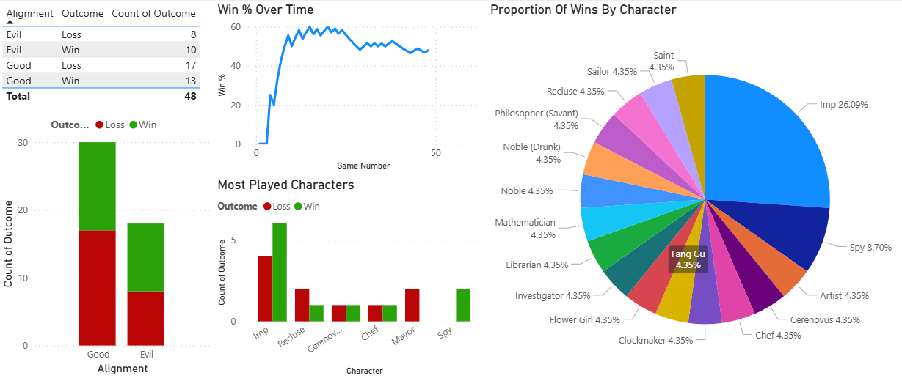

# Blood On The Clocktower (BotC) Data Visualisation

Blood On The Clocktower is a social deduction game that I've played quite a few games of. I've been keeping track of the games I've played, and I thought that a good exercise in data visualisation would be to create a report of this data in Microsoft Power BI.

The data used (accurate as of 11/08/2025) can be viewed in the table below:

<strong>BotC Games</strong>

<table class="tg"><thead>
  <tr>
    <th class="tg-0pky">Game Number</th>
    <th class="tg-0pky">Date</th>
    <th class="tg-0pky">Type</th>
    <th class="tg-0pky">Script</th>
    <th class="tg-0pky">Alignment</th>
    <th class="tg-0pky">Character</th>
    <th class="tg-0pky">Outcome</th>
    <th class="tg-0pky">Win %</th>
  </tr></thead>
<tbody>
  <tr>
    <td class="tg-dvpl">1</td>
    <td class="tg-dvpl">26/06/2024</td>
    <td class="tg-0pky">Normal</td>
    <td class="tg-0pky">Trouble Brewing</td>
    <td class="tg-0pky">Good</td>
    <td class="tg-0pky">Chef</td>
    <td class="tg-0pky">Loss</td>
    <td class="tg-0pky">0</td>
  </tr>
  <tr>
    <td class="tg-dvpl">2</td>
    <td class="tg-dvpl">26/06/2024</td>
    <td class="tg-0pky">Normal</td>
    <td class="tg-0pky">Trouble Brewing</td>
    <td class="tg-0pky">Good</td>
    <td class="tg-0pky">Mayor</td>
    <td class="tg-0pky">Loss</td>
    <td class="tg-0pky">0</td>
  </tr>
  <tr>
    <td class="tg-dvpl">3</td>
    <td class="tg-dvpl">01/07/2024</td>
    <td class="tg-0pky">Normal</td>
    <td class="tg-0pky">My Beloved Monster</td>
    <td class="tg-0pky">Good</td>
    <td class="tg-0pky">Balloonist</td>
    <td class="tg-0pky">Loss</td>
    <td class="tg-0pky">0</td>
  </tr>
  <tr>
    <td class="tg-dvpl">4</td>
    <td class="tg-dvpl">01/07/2024</td>
    <td class="tg-0pky">Normal</td>
    <td class="tg-0pky">Land Of The Midnight Sun</td>
    <td class="tg-0pky">Good</td>
    <td class="tg-0pky">Clockmaker</td>
    <td class="tg-0pky">Win</td>
    <td class="tg-0pky">25</td>
  </tr>
  <tr>
    <td class="tg-dvpl">5</td>
    <td class="tg-dvpl">01/07/2024</td>
    <td class="tg-0pky">Teensyville</td>
    <td class="tg-0pky">Race To The Bottom</td>
    <td class="tg-0pky">Evil</td>
    <td class="tg-0pky">Vortox</td>
    <td class="tg-0pky">Loss</td>
    <td class="tg-0pky">20</td>
  </tr>
  <tr>
    <td class="tg-dvpl">6</td>
    <td class="tg-dvpl">17/07/2024</td>
    <td class="tg-0pky">Normal</td>
    <td class="tg-0pky">Trouble Brewing</td>
    <td class="tg-0pky">Evil</td>
    <td class="tg-0pky">Imp</td>
    <td class="tg-0pky">Win</td>
    <td class="tg-0pky">33.33333333</td>
  </tr>
  <tr>
    <td class="tg-dvpl">7</td>
    <td class="tg-dvpl">17/07/2024</td>
    <td class="tg-0pky">Normal</td>
    <td class="tg-0pky">Trouble Brewing</td>
    <td class="tg-0pky">Evil</td>
    <td class="tg-0pky">Imp</td>
    <td class="tg-0pky">Win</td>
    <td class="tg-0pky">42.85714286</td>
  </tr>
  <tr>
    <td class="tg-dvpl">8</td>
    <td class="tg-dvpl">24/07/2024</td>
    <td class="tg-0pky">Normal</td>
    <td class="tg-0pky">Trouble Brewing</td>
    <td class="tg-0pky">Good</td>
    <td class="tg-0pky">Saint</td>
    <td class="tg-0pky">Win</td>
    <td class="tg-0pky">50</td>
  </tr>
  <tr>
    <td class="tg-dvpl">9</td>
    <td class="tg-dvpl">24/07/2024</td>
    <td class="tg-0pky">Normal</td>
    <td class="tg-0pky">Trouble Brewing</td>
    <td class="tg-0pky">Evil</td>
    <td class="tg-0pky">Spy</td>
    <td class="tg-0pky">Win</td>
    <td class="tg-0pky">55.55555556</td>
  </tr>
  <tr>
    <td class="tg-dvpl">10</td>
    <td class="tg-dvpl">31/07/2024</td>
    <td class="tg-0pky">Normal</td>
    <td class="tg-0pky">Bad Moon Rising</td>
    <td class="tg-0pky">Evil</td>
    <td class="tg-0pky">Godfather</td>
    <td class="tg-0pky">Loss</td>
    <td class="tg-0pky">50</td>
  </tr>
  <tr>
    <td class="tg-dvpl">11</td>
    <td class="tg-dvpl">31/07/2024</td>
    <td class="tg-0pky">Normal</td>
    <td class="tg-0pky">Sects &amp; Violets</td>
    <td class="tg-0pky">Good</td>
    <td class="tg-0pky">Mathematician</td>
    <td class="tg-0pky">Win</td>
    <td class="tg-0pky">54.54545455</td>
  </tr>
  <tr>
    <td class="tg-dvpl">12</td>
    <td class="tg-dvpl">17/08/2024</td>
    <td class="tg-0pky">Normal</td>
    <td class="tg-0pky">Trouble Brewing</td>
    <td class="tg-0pky">Evil</td>
    <td class="tg-0pky">Imp</td>
    <td class="tg-0pky">Win</td>
    <td class="tg-0pky">58.33333333</td>
  </tr>
  <tr>
    <td class="tg-dvpl">13</td>
    <td class="tg-dvpl">24/08/2024</td>
    <td class="tg-0pky">Normal</td>
    <td class="tg-0pky">A Perfect Place</td>
    <td class="tg-0pky">Evil</td>
    <td class="tg-0pky">Cerenovus</td>
    <td class="tg-0pky">Loss</td>
    <td class="tg-0pky">53.84615385</td>
  </tr>
  <tr>
    <td class="tg-dvpl">14</td>
    <td class="tg-dvpl">30/08/2024</td>
    <td class="tg-0pky">Normal</td>
    <td class="tg-0pky">Back To School</td>
    <td class="tg-0pky">Good</td>
    <td class="tg-0pky">Librarian</td>
    <td class="tg-0pky">Win</td>
    <td class="tg-0pky">57.14285714</td>
  </tr>
  <tr>
    <td class="tg-dvpl">15</td>
    <td class="tg-dvpl">30/08/2024</td>
    <td class="tg-0pky">Normal</td>
    <td class="tg-0pky">(You Will Never) Break The Chain</td>
    <td class="tg-0pky">Good</td>
    <td class="tg-0pky">Sailor</td>
    <td class="tg-0pky">Win</td>
    <td class="tg-0pky">60</td>
  </tr>
  <tr>
    <td class="tg-dvpl">16</td>
    <td class="tg-dvpl">31/08/2024</td>
    <td class="tg-0pky">Normal</td>
    <td class="tg-0pky">Trouble Brewing</td>
    <td class="tg-0pky">Good</td>
    <td class="tg-0pky">Recluse</td>
    <td class="tg-0pky">Loss</td>
    <td class="tg-0pky">56.25</td>
  </tr>
  <tr>
    <td class="tg-dvpl">17</td>
    <td class="tg-dvpl">31/08/2024</td>
    <td class="tg-0pky">Normal</td>
    <td class="tg-0pky">Sects &amp; Violets</td>
    <td class="tg-0pky">Evil</td>
    <td class="tg-0pky">Cerenovus</td>
    <td class="tg-0pky">Win</td>
    <td class="tg-0pky">58.82352941</td>
  </tr>
  <tr>
    <td class="tg-dvpl">18</td>
    <td class="tg-dvpl">04/09/2024</td>
    <td class="tg-0pky">Normal</td>
    <td class="tg-0pky">Bad Moon Rising</td>
    <td class="tg-0pky">Good</td>
    <td class="tg-0pky">Pacifist</td>
    <td class="tg-0pky">Loss</td>
    <td class="tg-0pky">55.55555556</td>
  </tr>
  <tr>
    <td class="tg-dvpl">19</td>
    <td class="tg-dvpl">04/09/2024</td>
    <td class="tg-0pky">Normal</td>
    <td class="tg-0pky">Trouble Brewing</td>
    <td class="tg-0pky">Evil</td>
    <td class="tg-0pky">Imp</td>
    <td class="tg-0pky">Win</td>
    <td class="tg-0pky">57.89473684</td>
  </tr>
  <tr>
    <td class="tg-dvpl">20</td>
    <td class="tg-dvpl">07/09/2024</td>
    <td class="tg-0pky">Normal</td>
    <td class="tg-0pky">Sects &amp; Violets</td>
    <td class="tg-0pky">Good</td>
    <td class="tg-0pky">Philosopher (Savant)</td>
    <td class="tg-0pky">Win</td>
    <td class="tg-0pky">60</td>
  </tr>
  <tr>
    <td class="tg-dvpl">21</td>
    <td class="tg-dvpl">07/09/2024</td>
    <td class="tg-0pky">Normal</td>
    <td class="tg-0pky">Trouble Brewing</td>
    <td class="tg-0pky">Good</td>
    <td class="tg-0pky">Monk</td>
    <td class="tg-0pky">Loss</td>
    <td class="tg-0pky">57.14285714</td>
  </tr>
  <tr>
    <td class="tg-dvpl">22</td>
    <td class="tg-dvpl">07/09/2024</td>
    <td class="tg-0pky">Normal</td>
    <td class="tg-0pky">Trouble Brewing</td>
    <td class="tg-0pky">Good</td>
    <td class="tg-0pky">Chef</td>
    <td class="tg-0pky">Win</td>
    <td class="tg-0pky">59.09090909</td>
  </tr>
  <tr>
    <td class="tg-dvpl">23</td>
    <td class="tg-dvpl">07/09/2024</td>
    <td class="tg-0pky">Normal</td>
    <td class="tg-0pky">Trouble Brewing</td>
    <td class="tg-0pky">Good</td>
    <td class="tg-0pky">Recluse</td>
    <td class="tg-0pky">Loss</td>
    <td class="tg-0pky">56.52173913</td>
  </tr>
  <tr>
    <td class="tg-dvpl">24</td>
    <td class="tg-dvpl">07/09/2024</td>
    <td class="tg-0pky">Normal</td>
    <td class="tg-0pky">Smoked Onions</td>
    <td class="tg-0pky">Good</td>
    <td class="tg-0pky">Noble (Drunk)</td>
    <td class="tg-0pky">Win</td>
    <td class="tg-0pky">58.33333333</td>
  </tr>
  <tr>
    <td class="tg-dvpl">25</td>
    <td class="tg-dvpl">14/09/2024</td>
    <td class="tg-0pky">Normal</td>
    <td class="tg-0pky">Sects &amp; Violets</td>
    <td class="tg-0pky">Good</td>
    <td class="tg-0pky">Dreamer</td>
    <td class="tg-0pky">Loss</td>
    <td class="tg-0pky">56</td>
  </tr>
  <tr>
    <td class="tg-dvpl">26</td>
    <td class="tg-dvpl">14/09/2024</td>
    <td class="tg-0pky">Normal</td>
    <td class="tg-0pky">Trouble Brewing</td>
    <td class="tg-0pky">Good</td>
    <td class="tg-0pky">Mayor</td>
    <td class="tg-0pky">Loss</td>
    <td class="tg-0pky">53.84615385</td>
  </tr>
  <tr>
    <td class="tg-dvpl">27</td>
    <td class="tg-dvpl">21/09/2024</td>
    <td class="tg-0pky">Normal</td>
    <td class="tg-0pky">Sects &amp; Violets</td>
    <td class="tg-0pky">Good</td>
    <td class="tg-0pky">Town Crier</td>
    <td class="tg-0pky">Loss</td>
    <td class="tg-0pky">51.85185185</td>
  </tr>
  <tr>
    <td class="tg-dvpl">28</td>
    <td class="tg-dvpl">21/09/2024</td>
    <td class="tg-0pky">Normal</td>
    <td class="tg-0pky">Bad Moon Rising</td>
    <td class="tg-0pky">Good</td>
    <td class="tg-0pky">Exorcist</td>
    <td class="tg-0pky">Loss</td>
    <td class="tg-0pky">50</td>
  </tr>
  <tr>
    <td class="tg-dvpl">29</td>
    <td class="tg-dvpl">21/09/2024</td>
    <td class="tg-0pky">Normal</td>
    <td class="tg-0pky">Trouble Brewing</td>
    <td class="tg-0pky">Good</td>
    <td class="tg-0pky">Washerwoman</td>
    <td class="tg-0pky">Loss</td>
    <td class="tg-0pky">48.27586207</td>
  </tr>
  <tr>
    <td class="tg-dvpl">30</td>
    <td class="tg-dvpl">21/09/2024</td>
    <td class="tg-0pky">Normal</td>
    <td class="tg-0pky">Trouble Brewing</td>
    <td class="tg-0pky">Good</td>
    <td class="tg-0pky">Investigator</td>
    <td class="tg-0pky">Win</td>
    <td class="tg-0pky">50</td>
  </tr>
  <tr>
    <td class="tg-dvpl">31</td>
    <td class="tg-dvpl">27/09/2024</td>
    <td class="tg-0pky">Normal</td>
    <td class="tg-0pky">Dark and Stormy-caught</td>
    <td class="tg-0pky">Good</td>
    <td class="tg-0pky">Noble</td>
    <td class="tg-0pky">Win</td>
    <td class="tg-0pky">51.61290323</td>
  </tr>
  <tr>
    <td class="tg-dvpl">32</td>
    <td class="tg-dvpl">27/09/2024</td>
    <td class="tg-0pky">Normal</td>
    <td class="tg-0pky">Malchemy</td>
    <td class="tg-0pky">Evil</td>
    <td class="tg-0pky">Imp</td>
    <td class="tg-0pky">Loss</td>
    <td class="tg-0pky">50</td>
  </tr>
  <tr>
    <td class="tg-dvpl">33</td>
    <td class="tg-dvpl">27/09/2024</td>
    <td class="tg-0pky">Normal</td>
    <td class="tg-0pky">Malchemy</td>
    <td class="tg-0pky">Evil</td>
    <td class="tg-0pky">Fang Gu</td>
    <td class="tg-0pky">Win</td>
    <td class="tg-0pky">51.51515152</td>
  </tr>
  <tr>
    <td class="tg-dvpl">34</td>
    <td class="tg-dvpl">27/09/2024</td>
    <td class="tg-0pky">Normal</td>
    <td class="tg-0pky">Induced Labour</td>
    <td class="tg-0pky">Good</td>
    <td class="tg-0pky">Shugenja</td>
    <td class="tg-0pky">Loss</td>
    <td class="tg-0pky">50</td>
  </tr>
  <tr>
    <td class="tg-dvpl">35</td>
    <td class="tg-dvpl">28/09/2024</td>
    <td class="tg-0pky">Normal</td>
    <td class="tg-0pky">Trouble Brewing</td>
    <td class="tg-0pky">Evil</td>
    <td class="tg-0pky">Imp</td>
    <td class="tg-0pky">Win</td>
    <td class="tg-0pky">51.42857143</td>
  </tr>
  <tr>
    <td class="tg-dvpl">36</td>
    <td class="tg-dvpl">28/09/2024</td>
    <td class="tg-0pky">Normal</td>
    <td class="tg-0pky">Trouble Brewing</td>
    <td class="tg-0pky">Evil</td>
    <td class="tg-0pky">Imp</td>
    <td class="tg-0pky">Loss</td>
    <td class="tg-0pky">50</td>
  </tr>
  <tr>
    <td class="tg-dvpl">37</td>
    <td class="tg-dvpl">28/09/2024</td>
    <td class="tg-0pky">Normal</td>
    <td class="tg-0pky">Sects &amp; Violets</td>
    <td class="tg-0pky">Good</td>
    <td class="tg-0pky">Artist</td>
    <td class="tg-0pky">Win</td>
    <td class="tg-0pky">51.35135135</td>
  </tr>
  <tr>
    <td class="tg-dvpl">38</td>
    <td class="tg-dvpl">29/05/2025</td>
    <td class="tg-0pky">Normal</td>
    <td class="tg-0pky">Trouble Brewing</td>
    <td class="tg-0pky">Evil</td>
    <td class="tg-0pky">Imp</td>
    <td class="tg-0pky">Win</td>
    <td class="tg-0pky">52.63157895</td>
  </tr>
  <tr>
    <td class="tg-dvpl">39</td>
    <td class="tg-dvpl">29/05/2025</td>
    <td class="tg-0pky">Normal</td>
    <td class="tg-0pky">Trouble Brewing</td>
    <td class="tg-0pky">Evil</td>
    <td class="tg-0pky">Imp</td>
    <td class="tg-0pky">Loss</td>
    <td class="tg-0pky">51.28205128</td>
  </tr>
  <tr>
    <td class="tg-dvpl">40</td>
    <td class="tg-dvpl">29/05/2025</td>
    <td class="tg-0pky">Normal</td>
    <td class="tg-0pky">Trouble Brewing</td>
    <td class="tg-0pky">Evil</td>
    <td class="tg-0pky">Poisoner</td>
    <td class="tg-0pky">Loss</td>
    <td class="tg-0pky">50</td>
  </tr>
  <tr>
    <td class="tg-dvpl">41</td>
    <td class="tg-dvpl">18/06/2025</td>
    <td class="tg-0pky">Normal</td>
    <td class="tg-0pky">Trouble Brewing</td>
    <td class="tg-0pky">Good</td>
    <td class="tg-0pky">Ravenkeeper</td>
    <td class="tg-0pky">Loss</td>
    <td class="tg-0pky">48.7804878</td>
  </tr>
  <tr>
    <td class="tg-dvpl">42</td>
    <td class="tg-dvpl">18/06/2025</td>
    <td class="tg-0pky">Normal</td>
    <td class="tg-0pky">Trouble Brewing</td>
    <td class="tg-0pky">Good</td>
    <td class="tg-0pky">Soldier</td>
    <td class="tg-0pky">Loss</td>
    <td class="tg-0pky">47.61904762</td>
  </tr>
  <tr>
    <td class="tg-dvpl">43</td>
    <td class="tg-dvpl">26/06/2025</td>
    <td class="tg-0pky">Normal</td>
    <td class="tg-0pky">Trouble Brewing</td>
    <td class="tg-0pky">Evil</td>
    <td class="tg-0pky">Imp</td>
    <td class="tg-0pky">Loss</td>
    <td class="tg-0pky">46.51162791</td>
  </tr>
  <tr>
    <td class="tg-dvpl">44</td>
    <td class="tg-dvpl">26/06/2025</td>
    <td class="tg-0pky">Normal</td>
    <td class="tg-0pky">Trouble Brewing</td>
    <td class="tg-0pky">Evil</td>
    <td class="tg-0pky">Spy</td>
    <td class="tg-0pky">Win</td>
    <td class="tg-0pky">47.72727273</td>
  </tr>
  <tr>
    <td class="tg-dvpl">45</td>
    <td class="tg-dvpl">26/06/2025</td>
    <td class="tg-0pky">Normal</td>
    <td class="tg-0pky">Trouble Brewing</td>
    <td class="tg-0pky">Good</td>
    <td class="tg-0pky">Recluse</td>
    <td class="tg-0pky">Win</td>
    <td class="tg-0pky">48.88888889</td>
  </tr>
  <tr>
    <td class="tg-dvpl">46</td>
    <td class="tg-dvpl">06/08/2025</td>
    <td class="tg-0pky">Normal</td>
    <td class="tg-0pky">Sects &amp; Violets</td>
    <td class="tg-0pky">Good</td>
    <td class="tg-0pky">Sweetheart</td>
    <td class="tg-0pky">Loss</td>
    <td class="tg-0pky">47.82608696</td>
  </tr>
  <tr>
    <td class="tg-dvpl">47</td>
    <td class="tg-dvpl">06/08/2025</td>
    <td class="tg-0pky">Normal </td>
    <td class="tg-0pky">Sects &amp; Violets</td>
    <td class="tg-0pky">Good</td>
    <td class="tg-0pky">Barber</td>
    <td class="tg-0pky">Loss</td>
    <td class="tg-0pky">46.80851064</td>
  </tr>
  <tr>
    <td class="tg-dvpl">48</td>
    <td class="tg-dvpl">06/08/2025</td>
    <td class="tg-0pky">Normal</td>
    <td class="tg-0pky">Sects &amp; Violets</td>
    <td class="tg-0pky">Good</td>
    <td class="tg-0pky">Flower Girl</td>
    <td class="tg-0pky">Win</td>
    <td class="tg-0pky">47.91666667</td>
  </tr>
</tbody></table>

An image of the report can be seen below:

From this, we can see that my win percentage peaked at game 15, with a 60 % win rate, before decreasing after a string of losses to hover at around 45-50 %. Just over 25 % (6/23) of my wins have come as the imp, with a win rate of 56 % as evil and 43 % as good.
