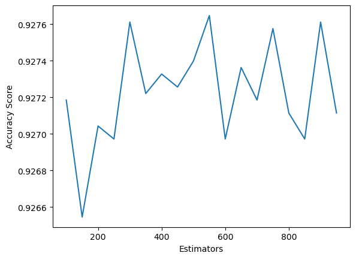

# Mental Health Predictor

The aim of this project will be to predict the occurrence of mental health problems of people in the dataset, given factors such as age, work stress and family history of mental health. Hopefully this will be a more orthodox project than my last one, and allow me to implement techniques that I have learned.

---

# Introduction

This is another binary classification project, with the data acquired from [https://www.kaggle.com/datasets/adilshamim8/exploring-mental-health-data/data](https://www.kaggle.com/datasets/adilshamim8/exploring-mental-health-data/data).

The process I intend to follow is:

- Import the data and decide how to handle missing values, either impution or column dropping as appropriate.
- Process the data to make it suitable for training, using ordinal encoding or one-hot encoding on the categoric variables.
- Choose an appropriate model.
- Employ some sort of metric to validate the model against.
- Use a grid search as well as altering which features are used in order to fit the best model.

# Creating the model

Here I imported the packages I used during the project, followed by importing the data we used. ```data.head()``` allows us to have a look at the top of the table.
```python
import pandas as pd
import math
import numpy as np
from sklearn.ensemble import RandomForestClassifier
from sklearn.metrics import accuracy_score
from sklearn.preprocessing import OrdinalEncoder
from sklearn.model_selection import train_test_split
from sklearn.impute import SimpleImputer
import matplotlib.pyplot as plt
data = pd.read_csv("./train.csv")
data.head()
```

<div>
<table border="1" class="dataframe">
  <thead>
    <tr style="text-align: right;">
      <th></th>
      <th>id</th>
      <th>Name</th>
      <th>Gender</th>
      <th>Age</th>
      <th>City</th>
      <th>Working Professional or Student</th>
      <th>Profession</th>
      <th>Academic Pressure</th>
      <th>Work Pressure</th>
      <th>CGPA</th>
      <th>Study Satisfaction</th>
      <th>Job Satisfaction</th>
      <th>Sleep Duration</th>
      <th>Dietary Habits</th>
      <th>Degree</th>
      <th>Have you ever had suicidal thoughts ?</th>
      <th>Work/Study Hours</th>
      <th>Financial Stress</th>
      <th>Family History of Mental Illness</th>
      <th>Depression</th>
    </tr>
  </thead>
  <tbody>
    <tr>
      <th>0</th>
      <td>0</td>
      <td>Aaradhya</td>
      <td>Female</td>
      <td>49.0</td>
      <td>Ludhiana</td>
      <td>Working Professional</td>
      <td>Chef</td>
      <td>NaN</td>
      <td>5.0</td>
      <td>NaN</td>
      <td>NaN</td>
      <td>2.0</td>
      <td>More than 8 hours</td>
      <td>Healthy</td>
      <td>BHM</td>
      <td>No</td>
      <td>1.0</td>
      <td>2.0</td>
      <td>No</td>
      <td>0</td>
    </tr>
    <tr>
      <th>1</th>
      <td>1</td>
      <td>Vivan</td>
      <td>Male</td>
      <td>26.0</td>
      <td>Varanasi</td>
      <td>Working Professional</td>
      <td>Teacher</td>
      <td>NaN</td>
      <td>4.0</td>
      <td>NaN</td>
      <td>NaN</td>
      <td>3.0</td>
      <td>Less than 5 hours</td>
      <td>Unhealthy</td>
      <td>LLB</td>
      <td>Yes</td>
      <td>7.0</td>
      <td>3.0</td>
      <td>No</td>
      <td>1</td>
    </tr>
    <tr>
      <th>2</th>
      <td>2</td>
      <td>Yuvraj</td>
      <td>Male</td>
      <td>33.0</td>
      <td>Visakhapatnam</td>
      <td>Student</td>
      <td>NaN</td>
      <td>5.0</td>
      <td>NaN</td>
      <td>8.97</td>
      <td>2.0</td>
      <td>NaN</td>
      <td>5-6 hours</td>
      <td>Healthy</td>
      <td>B.Pharm</td>
      <td>Yes</td>
      <td>3.0</td>
      <td>1.0</td>
      <td>No</td>
      <td>1</td>
    </tr>
    <tr>
      <th>3</th>
      <td>3</td>
      <td>Yuvraj</td>
      <td>Male</td>
      <td>22.0</td>
      <td>Mumbai</td>
      <td>Working Professional</td>
      <td>Teacher</td>
      <td>NaN</td>
      <td>5.0</td>
      <td>NaN</td>
      <td>NaN</td>
      <td>1.0</td>
      <td>Less than 5 hours</td>
      <td>Moderate</td>
      <td>BBA</td>
      <td>Yes</td>
      <td>10.0</td>
      <td>1.0</td>
      <td>Yes</td>
      <td>1</td>
    </tr>
    <tr>
      <th>4</th>
      <td>4</td>
      <td>Rhea</td>
      <td>Female</td>
      <td>30.0</td>
      <td>Kanpur</td>
      <td>Working Professional</td>
      <td>Business Analyst</td>
      <td>NaN</td>
      <td>1.0</td>
      <td>NaN</td>
      <td>NaN</td>
      <td>1.0</td>
      <td>5-6 hours</td>
      <td>Unhealthy</td>
      <td>BBA</td>
      <td>Yes</td>
      <td>9.0</td>
      <td>4.0</td>
      <td>Yes</td>
      <td>0</td>
    </tr>
  </tbody>
</table>
</div>

From this we can see multiple columns of categoric data, as well as columns with missing values. This means we need to find a way to deal with both of these problems before we fit our model.

## Preparing the data

```python
features = ['Gender', 'Age', 'Working Professional or Student', 'Pressure',
       'Satisfaction',
       'Have you ever had suicidal thoughts ?', 'Work/Study Hours',
       'Financial Stress', 'Family History of Mental Illness']
removed_features = ["City",'Sleep Duration','Dietary Habits']

contains_na = data.columns[data.isna().any()].tolist()
for column in contains_na:
    nan_percent = (data[column].isna().sum()/len(data.index))*100
    print(f"{column} - {nan_percent.round(5)} % Missing data")
```
```features``` is the columns we end up fitting the model with (more on that later). Here the code outputs what we can see below. This was to decide what to do with each column containing missing values. Generally 50 % missing values or more in a column means that you want to omit the column. 
```
Profession - 26.03412 % Missing data
Academic Pressure - 80.17271 % Missing data
Work Pressure - 19.84222 % Missing data
CGPA - 80.172 % Missing data
Study Satisfaction - 80.17271 % Missing data
Job Satisfaction - 19.83653 % Missing data
Dietary Habits - 0.00284 % Missing data
Degree - 0.00142 % Missing data
Financial Stress - 0.00284 % Missing data
```

This 50 % rule, as-written, would mean that we remove the "Academic Pressure" and "Study Satisfaction" columns, as they both contain only 20 % of the data. However, from ```data.head()``` and looking more closely at the data, we can see that entries either contain an "Academic Pressure" or "Work Pressure" value, and either a "Study Satisfaction" or "Job Satisfaction" value, meaning that combining these into two columns from four makes a lot of sense:
```python
content_list = {"Pressure":[],"Satisfaction":[]}
combine_dict = {"Pressure":["Work Pressure","Academic Pressure"],"Satisfaction":["Job Satisfaction","Study Satisfaction"]}
for index,row in data.iterrows():
    for case in combine_dict.keys():
        if not np.isnan(row[combine_dict[case][0]]):
            content_list[case].append(row[combine_dict[case][0]])
        elif not np.isnan(row[combine_dict[case][1]]):
            content_list[case].append(row[combine_dict[case][1]])
        else:
            content_list[case].append(np.nan)
data.insert(loc=6,column="Pressure",value=content_list["Pressure"])
data.insert(loc=9,column="Satisfaction",value=content_list["Satisfaction"])
data = data.drop(["Work Pressure","Academic Pressure","Job Satisfaction","Study Satisfaction"],axis=1)
```
Following this, performing the same calculation on the columns with missing values:
```python
contains_na = data.columns[data.isna().any()].tolist()
for column in contains_na:
    nan_percent = (data[column].isna().sum()/len(data.index))*100
    print(f"{column} - {nan_percent.round(5)} % Missing data")
```
```
Pressure - 0.01493 % Missing data
Profession - 26.03412 % Missing data
Satisfaction - 0.01066 % Missing data
CGPA - 80.172 % Missing data
Dietary Habits - 0.00284 % Missing data
Degree - 0.00142 % Missing data
Financial Stress - 0.00284 % Missing data
```
We now find that the only column with a high proportion of missing values is the "CGPA" value. As this column only applies to students, of which approximately only 20 % of the entries are, I decided to drop this column from the features used to fit the model.


```python
X = data[features]
y = data["Depression"]
X_train, X_valid, y_train, y_valid = train_test_split(X, y, train_size=0.8, test_size=0.2,random_state=0)
```
Here the data is split into a test and validation set, with an 80/20 split.

```python
s = (X_train.dtypes == 'object')
categoric_features = list(s[s].index)
print(categoric_features)
```

```
['Gender', 'Working Professional or Student', 'Have you ever had suicidal thoughts ?', 'Family History of Mental Illness']
```
Here we can see the categoric variables present in our list of features from the top of the notebook. These are the columns that will need to be encoded. The ordinal encoder was used for all columns as any columns with over two unique answers contained many unique responses, which would result in many columns being added through one-hot encoder, thus not being very feasible.

```
ordinal_encoder = OrdinalEncoder()
X_train[categoric_features] = ordinal_encoder.fit_transform(X_train[categoric_features])
X_valid[categoric_features] = ordinal_encoder.transform(X_valid[categoric_features])
```
The "City", "Sleep Duration" and "Dietary Habits" columns were removed due to the number of unique responses resulting in errors when the encoder attempted to encode the validation data. It was easier just to remove the columns with problematic values.

```python
simple_imputer = SimpleImputer()
contains_na = data.columns[data.isna().any()].tolist()
X_train_imputed = pd.DataFrame(simple_imputer.fit_transform(X_train))
X_valid_imputed = pd.DataFrame(simple_imputer.transform(X_valid))

# Imputation removed column names; put them back
X_train_imputed.columns = X_train.columns
X_valid_imputed.columns = X_valid.columns
```
Here we used the imputer to fill in missing values in the dataframe. We can now fit the model.

## Fitting the model

```python
scores = []
estimator_numbers = []
for n_est in range(100,1000,50):
    estimator_numbers.append(n_est)
    model = RandomForestClassifier(n_estimators=n_est)
    model.fit(X_train_imputed,y_train)
    y_pred = model.predict(X_valid_imputed)
    scores.append(accuracy_score(y_valid,y_pred))

plt.plot(estimator_numbers,scores)
plt.xlabel("Estimators")
plt.ylabel("Accuracy Score")
plt.show()
```
Here we used a grid search to find the optimum number of estimators for our random forest by fitting models with estimator values of between 100 and 950 and calculating the accuracy scores for each. The results of this can be seen in the figure below.




The accuracy reaches a maximum value of approximately 92.76 % at around 300 estimators, so this is the value we will use going forward. This is a pretty good accuracy value already, but in the next section we will try to increase this.

# Improving the accuracy
