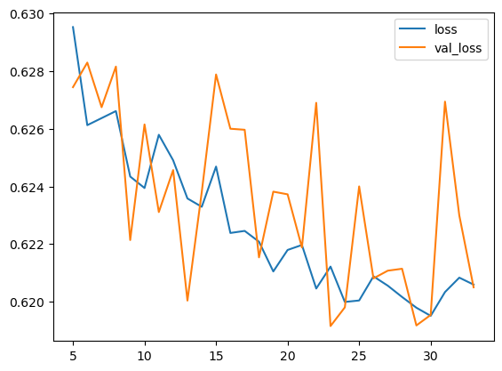
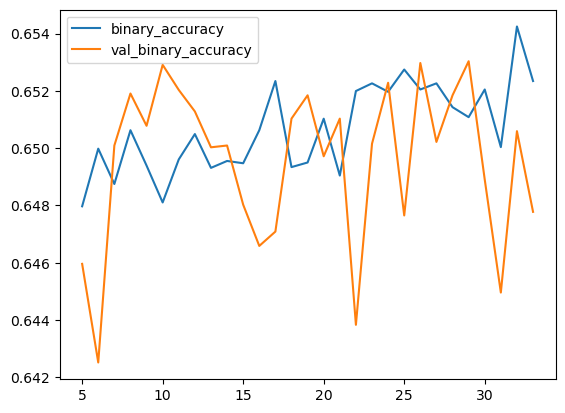

# WTA Tennis Match Prediction


This was my first foray into the realm of machine-learning without any chemistry involved. I was inspired to do this during the 2023 US Open. I knew very little about Python-based machine learning at that point, so it's all quite messy and there is little parameter testing. I also definitely didn't pick an easy dataset to start with, but this project taught me lots of useful things about cleaning and processing data to allow it to be used to train a model.
The bottom section contains a recent edition where I added more recent matches and code to test a recent installation of keras, using a Pytorch backend.

---

## Introduction

The aim of this project was to use past WTA match data to attempt to successfully predict tennis results.

## Module importing

The module importing section is messy as I was learning and so imported many modules that I didn't actually end up using.

```python
import sklearn
import pandas as pd
from random import randint
from copy import deepcopy
from sklearn.model_selection import train_test_split
from sklearn.ensemble import RandomForestClassifier
from sklearn.metrics import accuracy_score
from sklearn.pipeline import Pipeline
from sklearn.preprocessing import OneHotEncoder, OrdinalEncoder, LabelBinarizer
import json
import numpy as np
data_dir = # directory containing CSV results files
```
## Data Loading and Preprocessing

The data used was taken from https://github.com/JeffSackmann/tennis_wta, I used the data for matches between 2023 (current, at the time of this project) and 2005, as that seemed to be a reasonable point to go back to, as the majority of current players were not playing back then.

In this code block the data is processed into a format where it can be fed into scikit-learn.

The features I decided to use were the surface, tournament level (Grand slam, WTA 1000 etc.), year, and the names, ranks, heights and handedness of each player. A potential problem with the format of the data, however, was that the winning player was always the first player name, so a potential model might recognise this, and we want it to build a model based on other factors.

To counter this, I took the features specific to the two players (name, rank, height and handedness) and randomised whether each player was "player 1" or "player 2" using ```randint(1,2)```. All categoric variables were also converted to numeric variables using ```.map()``` from the pandas module, with each player assigned a unique ID. I was not aware of one hot encoding at the time, so this was not used.

As there was no longer a "winning player" column, an additional "winner" column had to be implemented, with a value of either 1 or 2 depending on the value of ```randint```.

```python
data = {}
player_data = {}
tracked_stats = ['id','hand','ht','rank'] 
for year in range(2005,2024):
    current_year = pd.read_csv(data_dir + f'wta_matches_{year}.csv', usecols=['surface','tourney_level','winner_name','loser_name','winner_id', 'loser_id', 'winner_rank', 'loser_rank', 'best_of','winner_hand','loser_hand','winner_ht','loser_ht'])
    current_year = current_year.drop(current_year[current_year['surface'] == 'Carpet'].index)
    for i in current_year.iterrows():
        for j in current_year.columns:
            if pd.isnull(i[1][j]):
                if j == 'winner_rank' or j == 'loser_rank':
                    continue
                else:
                    data_year = current_year.drop(i[0])
    data_year['surface'] = data_year['surface'].map({'Hard':1,'Clay':2,'Grass':3})
    data_year['tourney_level'] = data_year['tourney_level'].map({'G':1,'F':2,'O':2,'PM':3,'P':4,'I':5,'T1':3,'T2':4,'T3':5,'T4':5,'T5':5,'D':6})

    for wl in ['winner','loser']:
        data_year[f'{wl}_hand'] = data_year[f'{wl}_hand'].map({'R':1,'L':2,'U':3})
    data[year] = data_year
    data[year]['year'] = year
    player = {1:{},2:{}}
    for stat in tracked_stats:
        player[1][stat] = []
        player[2][stat] = []
    winner_number = []
    for i in data[year].iterrows():
        for player_lw in ['winner', 'loser']:
            if i[1][f'{player_lw}_name'] not in player_data.keys():
                player_data[i[1][f'{player_lw}_name']] = {}
                for stat in tracked_stats[:-1]:
                    player_data[i[1][f'{player_lw}_name']][stat] = i[1][f'{player_lw}_{stat}']

            if i[1][f'{player_lw}_id'] not in player_data.keys():
                player_data[i[1][f'{player_lw}_id']] = i[1][f'{player_lw}_name']

        flip = randint(1,2)
        winlossno = {}
        if flip == 1:
            winlossno['winner'] = 1
            winlossno['loser'] = 2
        elif flip == 2:
            winlossno['winner'] = 2
            winlossno['loser'] = 1
        for player_lw in ['winner', 'loser']:
            for stat in tracked_stats:
                player[winlossno[player_lw]][stat].append(i[1][f'{player_lw}_{stat}'])
        winner_number.append(flip)
    for stat in tracked_stats:
        data[year][f'player_1_{stat}'] = player[1][stat]
        data[year][f'player_2_{stat}'] = player[2][stat]
    data[year]['winner'] = winner_number
    for stat in tracked_stats:
        data[year].drop(labels=f'loser_{stat}', axis=1, inplace=True)
        data[year].drop(labels=f'winner_{stat}', axis=1, inplace=True)
    for wl in ['winner','loser']:
        data[year].drop(labels=f'{wl}_name', axis=1, inplace=True)
```

After the above processing, the yearly data was concatenated to form a much larger file containing all data, with a dictionary of player names and IDs written to ```players.json```. As there was missing data for player rank, and this was a column that I wanted to use, a high rank of 3000 filled missing values.

```python
df = pd.concat([data[i] for i in data], ignore_index=True)

df.fillna(3000, inplace=True)

json_object = json.dumps(player_data, indent=4)
df.to_csv('tennis.csv', index=False)
 
# Writing to sample.json
with open("players.json", "w") as outfile:
    outfile.write(json_object)
```

Displaying the top of the processed data with ```df.head()``` shows that all columns are now in a format that can train a model.

The first five rows of the final processed DataFrame:

| | surface | tourney_level | best_of | year | player_1_id | player_2_id | player_1_hand | player_2_hand | player_1_ht | player_2_ht | player_1_rank | player_2_rank | winner |
|---|---|---|---|---|---|---|---|---|---|---|---|---|---|
| 0 | 2.0 | 6.0 | 3 | 2005 | 201527 | 201423 | 1.0 | 1.0 | 170.0 | 175.0 | 1024.0 | 135.0 | 2 |
| 1 | 2.0 | 6.0 | 3 | 2005 | 201481 | 201490 | 1.0 | 1.0 | 165.0 | 170.0 | 3000.0 | 280.0 | 1 |
| 2 | 2.0 | 6.0 | 3 | 2005 | 201423 | 201490 | 1.0 | 1.0 | 175.0 | 170.0 | 135.0 | 280.0 | 2 |
| 3 | 2.0 | 6.0 | 3 | 2005 | 201335 | 201481 | 1.0 | 1.0 | 172.0 | 165.0 | 3000.0 | 3000.0 | 2 |
| 4 | 1.0 | 6.0 | 3 | 2005 | 200079 | 200055 | 1.0 | 1.0 | 175.0 | 172.0 | 14.0 | 71.0 | 1 |


## Model Training
I used a random forest classifier model for this project, as the decision tree is popular and a fairly simple concept, and can be used for classicationis trained on the prepared data. Using a forest increases the accuracy of the model.

```python
model = RandomForestClassifier(verbose=1,n_estimators=2000,n_jobs=-1,bootstrap=False)
model.fit(df[['year','tourney_level','surface','best_of','player_1_id','player_1_rank','player_1_hand','player_1_ht','player_2_id','player_2_rank','player_2_hand','player_2_ht']].values,df['winner'])
```

I then saved the trained model using joblib for future use.

```python
from joblib import dump, load
dump(model, 'WTA_model.joblib') 
```

## Making a Prediction

Finally, a test prediction between Iga Swiatek and Aryna Sabalenka on a hard court in 2023:

```python
year = 2023
tourney_level = 1
surface = 1
best_of = 3
player_1 = 'Iga Swiatek'
player_1_rank = 6
player_2 = 'Aryna Sabalenka'
player_2_rank =2

print(model.predict([[year,tourney_level,surface,best_of,player_data[player_1]['id'],player_1_rank,player_data[player_1]['hand'],player_data[player_1]['ht'],player_data[player_2]['id'],player_2_rank,player_data[player_2]['hand'],player_data[player_2]['ht']]]))
```

Prediction Output:
```python
[2]
```

A interesting observation from fiddling with this command was that it predicted Sabalenka to win, no matter what combination of factors I put up against her. It felt like a shortcoming at the time, but considering she is now currently (July 2025) world number 1, with the most ranking points since Serena Williams, maybe it's a better model than I thought?

# Neural Network Attempt (July 2025)

This was more a way to check that my recent installation of Keras 3 with a Pytorch backend was working. I successfully used a GPU to train the model. The code is taken from the deep learning Kaggle course.

---

Here I define the model that I will be training. The sigmoid activation function ensures that the output is either a 0 or a 1. This did require a tweaking of the "winner" column. I ended up changing it to "Player 1 win", meaning that a 0 meant that player 2 won.

```python
import keras
from keras import layers
import torch
model = keras.Sequential([
    layers.Dense(128, activation='relu', input_shape=[X_train.shape[1]]),
    layers.Dense(128, activation='relu'),
    layers.Dense(128, activation='relu'),  
    layers.Dense(256, activation='relu'),
    layers.Dense(128, activation='relu'),
    layers.Dense(128, activation='relu'),  
    layers.Dense(256, activation='relu'),    
    layers.Dense(1, activation='sigmoid'),
])
```

The adam optimisation algorithm was used to train the model. The loss and metrics used are identical to those used in the binary classification section of the Kaggle course. Early stopping is implemented to prevent overfitting.

```python
model.compile(
    optimizer='adam',
    loss='binary_crossentropy',
    metrics=['binary_accuracy'],
)

early_stopping = keras.callbacks.EarlyStopping(
    patience=20,
    min_delta=0.001,
    restore_best_weights=True,
)
```

Here we fit the neural network. ```X_train```, ```y_train```, ```X_valid``` and ```y_valid``` were all defined earlier in my notebook, which is not included here.

```python
history = model.fit(
    X_train, y_train,
    validation_data=(X_valid, y_valid),
    batch_size=512,
    epochs=1000,
    callbacks=[early_stopping]
)
```

This code block plots the loss and accuracy during training which can be seen in Figure 1 and 2 below.

```python
history_df = pd.DataFrame(history.history)
history_df.loc[5:, ['loss', 'val_loss']].plot()
history_df.loc[5:, ['binary_accuracy', 'val_binary_accuracy']].plot()

print(("Best Validation Loss: {:0.4f}" +
      "\nBest Validation Accuracy: {:0.4f}")
      .format(history_df['val_loss'].min(), 
              history_df['val_binary_accuracy'].max()))
```


### Training History

Here we can see that the early stopping terminated the training after epoch 73.

```
Epoch 1/1000
73/73 ━━━━━━━━━━━━━━━━━━━━ 1s 11ms/step - binary_accuracy: 0.5821 - loss: 1.2507 - val_binary_accuracy: 0.6393 - val_loss: 0.6940
Epoch 2/1000
73/73 ━━━━━━━━━━━━━━━━━━━━ 1s 12ms/step - binary_accuracy: 0.6429 - loss: 0.6586 - val_binary_accuracy: 0.6269 - val_loss: 0.6521
...
Epoch 34/1000
73/73 ━━━━━━━━━━━━━━━━━━━━ 1s 13ms/step - binary_accuracy: 0.6544 - loss: 0.6202 - val_binary_accuracy: 0.6478 - val_loss: 0.6205
```


## Results

The early stopping uses the weights that achieved the best loss and accuracy.

Best Validation Loss: 0.6192 <br>
Best Validation Accuracy: 0.6530<br>

Figure 1: Training and validation loss over epochs.

 

Figure 2: Training and validation accuracy over epochs.



This gives a model with an accuracy of approximately 65 %, which isn't amazing but it isn't bad for a first attempt in something as unpredictable as sport. This model didn't use the player IDs in its prediction. Interestingly, when player IDs were included in the model, the accuracy dropped to 49.5 %. Presumably there just wasn't enough data for the model to identify the connection between some IDs and a higher win rate. It's possible that using one hot encoding for the player names would improve this, although this would require many more columns in the dataset.

# Conclusions

From this project, I learnt how to process data in a way that is compatible with machine learning models, and which models can be used for which problem types.

Next time I should ensure that I have a way to evaluate the model, as I did not implement this in the first section, meaning that changes I made had no obvious effect.

Although this project wasn't the most rigourous, it allowed me to take away multiple things that I can implement next time.
